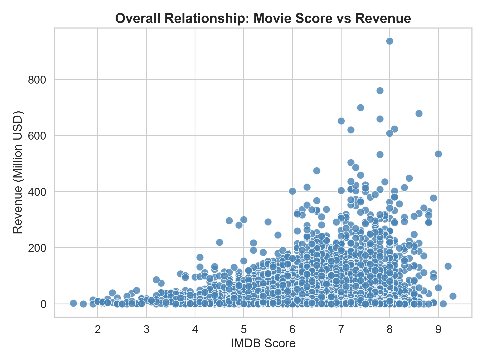
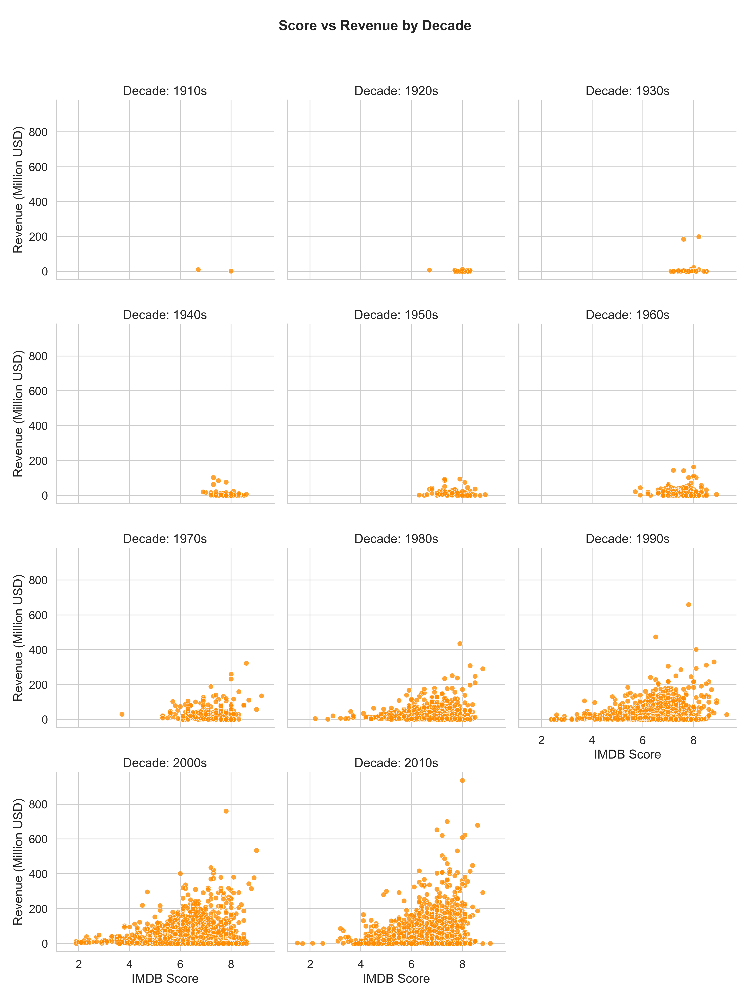
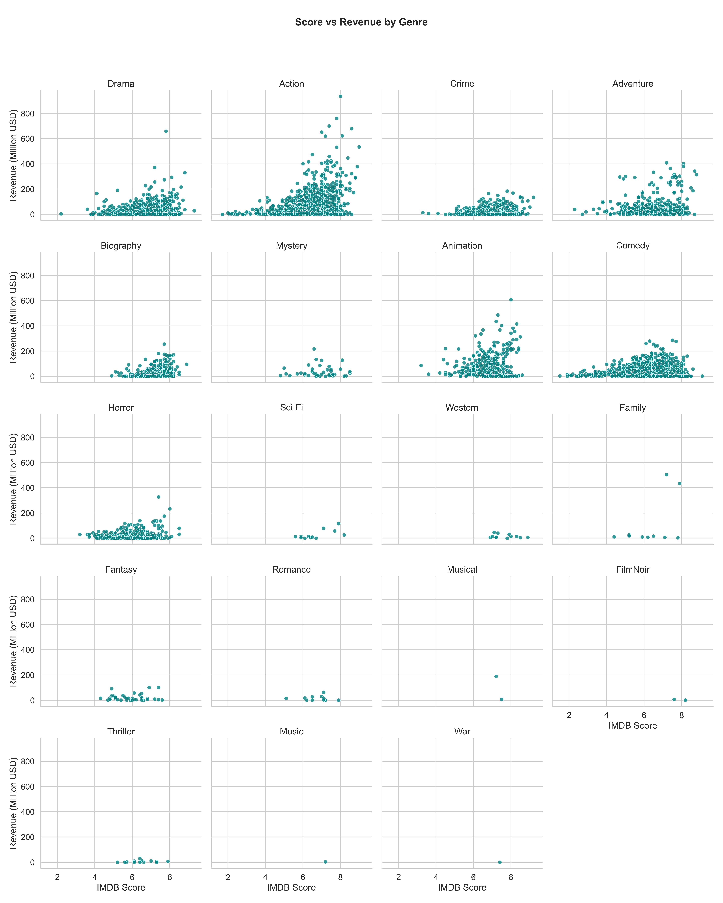

# Movie Rating & Revenue Analysis

This project explores the relationship between **IMDB scores** and **box office revenue** using a curated dataset of top-rated films.  
We applied **data cleaning**, **outlier removal (IQR method)**, and **visual exploratory analysis** to uncover general trends across genres and decades.

---

## Project Structure

### Data Cleaning & Preprocessing

**Steps performed in `data_cleaning.py`:**
1. Converted numeric columns (Year, Score, Metascore, Runtime, Revenue) to numeric types  
2. Extracted the **primary genre** (first genre in list)
3. Created a new variable: `Decade = (Year // 10) * 10`
4. Removed rows missing `Score` or `Revenue`
5. Saved clean dataset to `movies_clean.csv`
6. Removed **outliers using the IQR method** (see below)

---

### Descriptive Statistics (Clean Dataset)

| Statistic | Score | Revenue (M USD) |
|------------|--------|----------------|
| count | 6849 | 6849 |
| mean | 6.54 | 21.92 |
| std | 0.99 | 25.41 |
| min | 1.5 | 0.0 |
| 25% | 6.0 | 1.4 |
| 50% | 6.6 | 12.23 |
| 75% | 7.3 | 34.4 |
| max | 9.3 | 106.81 |


> After removing outliers (using IQR):
> - **Upper bound:** Q3 + 1.5×IQR ≈ 530 M USD  
> - Movies above this threshold were excluded (e.g., *Avengers: Endgame*)  
> - Remaining dataset better represents general movie trends.

---

### Visualization Results


 

### Overall Relationship
- Weak positive correlation between **IMDB Score** and **Revenue**  
- High-rated movies **tend to** have higher revenue, but not always  
- Some critically acclaimed films (e.g., *Shawshank Redemption*) have modest box office



### By Decade
- 1990s & 2000s: Narrower revenue range, more balanced distribution  
- 2010s: Wide spread — blockbuster era causes large revenue variation  
- Recent decades show increased commercialization of high-grossing films



### By Genre
- **Action / Adventure**: High revenue but slightly lower scores  
- **Drama**: High scores but moderate revenue  
- **Sci-Fi / Fantasy**: Often combine high scores and strong revenue  

---

### Outlier Removal (IQR Method)
To prevent blockbusters from distorting the relationship, we removed extreme outliers based on revenue:

\[
Q1 = 25^{th} \text{ percentile}, \quad Q3 = 75^{th} \text{ percentile}, \quad IQR = Q3 - Q1
\]
\[
\text{Upper Bound} = Q3 + 1.5 \times IQR
\]

Movies exceeding the upper bound were excluded from subsequent scatterplots.

---

### Key Insights
- There is **no strong linear correlation** between score and revenue overall.  
- **Genre and decade** explain much more variation than raw rating alone.  
- **Outlier removal** reveals that most films follow moderate, consistent patterns.

---

### Tech Stack
- **Python 3.9+**
- **pandas**, **matplotlib**, **seaborn**

To reproduce:
```bash
pip install pandas matplotlib seaborn
python data_cleaning.py
python scatterplots_by_decade.py

